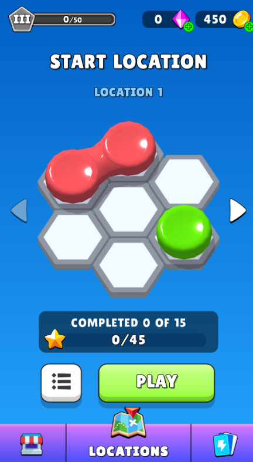
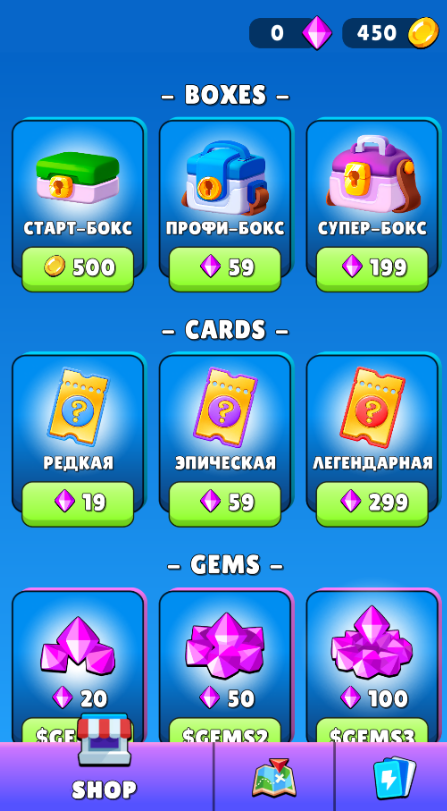
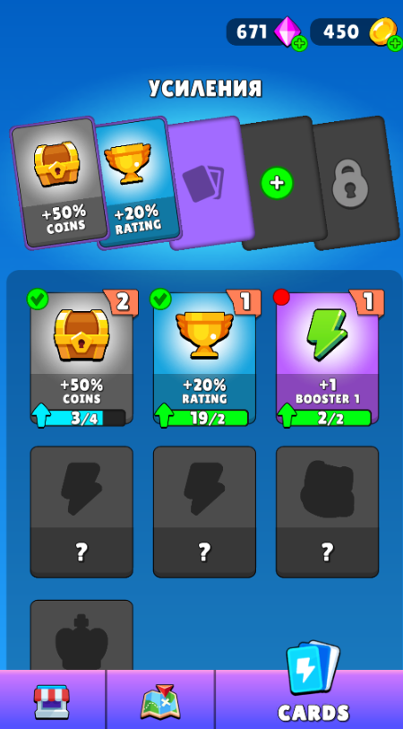
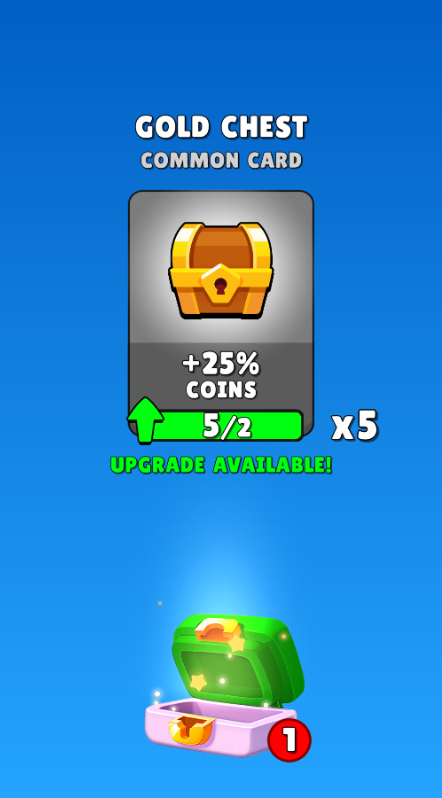

# Gamebox

Мета-оболочка для игр на Unity. Меню, прогресс, экономика и монетизация уже собраны — игровой уровень подключается через `LevelController`.

`v2.0.7` · Unity `2021.3` · пакет [`com.devnote.gamebox`](Packages/com.devnote.gamebox)

**[Документация](https://buildin.ai/share/6911875c-4ef4-4db5-afa3-76648a19088d?code=M50M76)**

 

  
  &nbsp;&nbsp;
  
  &nbsp;&nbsp;
  
  &nbsp;&nbsp;
  

  <b>Локации</b> &nbsp;·&nbsp; <b>Магазин</b> &nbsp;·&nbsp; <b>Карты</b> &nbsp;·&nbsp; <b>Лутбоксы</b>

---

## Что входит

### Меню и уровни

Экран локаций, список уровней и звёзды за прохождение. Меню открывается с заданной лиги.

Цикл уровня уже замкнут: старт, победа, поражение, ревайв и пауза. После уровня оболочка открывает следующий уровень или возвращает игрока в меню.

  

### Карты усилений

Коллекция карт, слоты и апгрейд за алмазы. Карты меняют экономику и геймплей: бонус к монетам, рейтингу, бустерам.

  

### Лутбоксы

Коробки с картами, экран открытия и туториал по боксам и картам.

  

### Магазин

Покупка боксов, карт и алмазов. Оплата идёт через `IPurchase`.

  

### Прогресс и лиги

Сохраняются локации, уровни, рейтинг и последний сыгранный уровень — всё в `IGameState`.

Лиги идут от Stone до Imperium. Новая лига выдаёт награды и открывает контент.

### Предметы

Монеты, алмазы и остальные ключи `ItemKey`: начисление, счётчики на экранах и анимация набора.

### Монетизация

- Interstitial с порога по уровню
- Rewarded-ревайв
- Окно отключения рекламы
- Оценка игры с наградой

Реклама, покупки, сохранения, аналитика, лидерборды и оценка подключены через сервисы DevNote.

### Конфиги

`GameboxConfig` хранит локации, награды, лиги, карты, цены магазина и пороги окон. Часть данных подгружается из таблицы.
